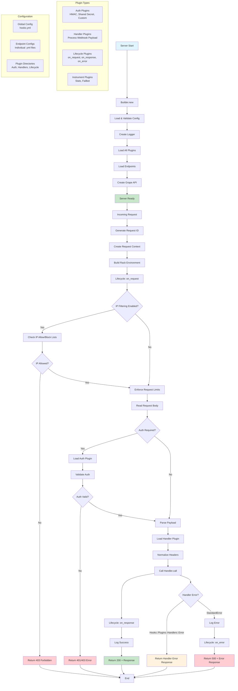

# hooks

[](https://github.com/github/hooks/actions/workflows/build.yml)
[](https://github.com/github/hooks/actions/workflows/test.yml)
[](https://github.com/github/hooks/actions/workflows/lint.yml)
[](https://github.com/github/hooks/actions/workflows/integration.yml)
[](https://github.com/github/hooks/actions/workflows/release.yml)

A Pluggable Webhook Server Framework written in Ruby.


## About ⭐

Hooks is a RESTful webhook server framework written in Ruby. It is designed to be simple, flexible, and extensible, allowing you to easily create and manage webhook endpoints for your applications. Hooks is designed to consolidate and process incoming webhook requests in a single place, making it easier to handle webhooks from multiple sources.

**Why Hooks?**: If you have to handle webhooks from multiple sources, you might end up with a lot of code that is similar but not quite the same. Hooks allows you to define a set of common behaviors and then extend them with plugins, so you can handle webhooks in a consistent way across your application.

## Features 🚀

- **Pluggable Architecture**: Easily extend the functionality of your webhook server with plugins for authentication, handlers, and more.
- **Flexible Configuration**: Customize your webhook server via a simple configuration file, or programmatically with pure Ruby.
- **Built-in Auth Plugins**: Support for common authentication methods like HMAC, shared secrets, and more.

## How It Works 🔧

Hooks is designed to be very easy to setup and use. It provides a simple DSL for defining webhook endpoints and then you can use plugins to handle the incoming requests and optionally authenticate them.

### Architecture Flow

The following Mermaid diagram shows the complete request processing flow, including server bootstrap, plugin loading, and webhook request handling:



Here is a very high-level overview of how Hooks works:

1. You define a global configuration file (e.g. `hooks.yml`) where you can specify where your webhook endpoint configs are located, and the directory where your plugins are located. Here is an example of a minimal configuration file:

    ```yaml
    # file: hooks.yml
    handler_plugin_dir: ./plugins/handlers
    auth_plugin_dir: ./plugins/auth
    endpoints_dir: ./config/endpoints

    log_level: debug

    root_path: /webhooks
    health_path: /health
    version_path: /version

    environment: development # will be overridden by the RACK_ENV environment variable if set
    ```

2. Then in your `config/endpoints` directory, you can define all your webhook endpoints in separate files. Here is an example of a simple endpoint configuration file:

    ```yaml
    # file: config/endpoints/hello.yml
    path: /hello
    handler: my_custom_handler # This is a custom handler plugin you would define in the plugins/handlers directory (snake_case)
    ```

    > Note: If your handler's class name is `MyCustomHandler`, you would define it in the `plugins/handlers/my_custom_handler.rb` file. The `handler` field in the endpoint configuration file should be the snake_case version of the class name. So if your handler class is `MyCustomHandler`, you would use `my_custom_handler` in the endpoint configuration file.

3. Now create a corresponding handler plugin in the `plugins/handlers` directory. Here is an example of a simple handler plugin:

    ```ruby
    # file: plugins/handlers/my_custom_handler.rb
    class MyCustomHandler < Hooks::Plugins::Handlers::Base
      def call(payload:, headers:, env:, config:)
        # Process the incoming webhook - optionally use the payload and headers
        # to perform some action or validation
        # For this example, we will just return a success message
        {
          status: "success",
          handler: "my_custom_handler",
          payload_received: payload,
          timestamp: Time.now.utc.iso8601
        }
      end
    end
    ```

That is pretty much it! Below you will find more detailed instructions on how to install and use Hooks, as well as how to create your own plugins. This high-level overview should give you a good idea of how Hooks works and how you can use it to handle webhooks in your applications. You may also be interested in using your own custom authentication plugins to secure your webhook endpoints, which is covered in the [Authentication](#authentication-plugins) section below.

## Installation 💎

You can download this Gem from [GitHub Packages](https://github.com/github/hooks/pkgs/rubygems/hooks-ruby) or [RubyGems](https://rubygems.org/gems/hooks-ruby)

Via a Gemfile:

```ruby
source "https://rubygems.org"

gem "hooks-ruby", "~> X.X.X" # Replace X.X.X with the latest version
```

Once added to your Gemfile, run:

```bash
bundle install
```

## Usage 💻

### Basic

Here is a simple example of how to set up a Hooks server.

First, create a `config.ru` file:

```ruby
# file: config.ru
require "hooks"

# See the config documentation below for the full list of available options
# For this example, we will just set use_catchall_route to true
config = {
  use_catchall_route: true # will use the DefaultHandler for /webhooks/* - just an example/demo
}

# Builds the Hooks application with the provided configuration
app = Hooks.build(config: config)

# Run the Hooks application when the server starts
run app
```

Run the hooks server via puma which is the recommended server for Hooks:

```bash
bundle exec puma --tag hooks
```

Send a webhook request to the server in a separate terminal:

```bash
curl --request POST \
  --url http://0.0.0.0:9292/webhooks/hello \
  --header 'content-type: application/json' \
  --data '{}'

# => { "message": "webhook processed successfully", "handler": "DefaultHandler", "timestamp": "2025-06-10T23:15:07-07:00" }
```

Congratulations! You have successfully set up a basic Hooks server which will listen to anything under `/webhooks/*` and respond with a success message.

Keep reading to learn how to customize your Hooks server with different plugins for handlers, authentication, and more.

### Advanced

This section will go into a more advanced and detailed example of how to setup a Hooks server with custom plugins, authentication, and more. This section also assumes you already have the `hooks-ruby` gem installed via a bundler Gemfile as shown in the [Installation](#installation-) section above.

Before we get into the details, here is a high-level overview of the steps involved:

1. **Define your configuration**: Create a `hooks.yml` file to define your global configuration, including the directories for your plugins and endpoints.
2. **Create your endpoint configurations**: Define your webhook endpoints in the `config/endpoints` directory, specifying the path and the handler plugin to use.
3. **Implement your handler plugins**: Create custom handler plugins in the `plugins/handlers` directory to process incoming webhook requests.
4. **Implement authentication plugins (optional)**: If you want to secure your webhook endpoints, create custom authentication plugins in the `plugins/auth` directory. Note that you might just be able to get away with using the built-in authentication plugins ([`hmac`](lib/hooks/plugins/auth/hmac.rb), or [`shared_secret`](lib/hooks/plugins/auth/shared_secret.rb)) for most use cases.

This example will assume the following directory structure:

```text
├── config/
│   ├── hooks.yml                    # global hooks config
│   ├── puma.rb                      # puma config
│   └── endpoints/
│       ├── hello.yml
│       └── goodbye.yml
└── plugins/
    ├── handlers/                    # custom handler plugins
    │   ├── hello_handler.rb
    │   └── goodbye_handler.rb
    ├── lifecycle/                   # custom lifecycle plugins (optional)
    │   └── my_lifecycle_plugin.rb   # custom lifecycle plugin (optional)
    ├── instruments/                 # custom instrument plugins (optional)
    │   ├── stats.rb                 # a custom stats instrument plugin (optional)
    │   └── failbot.rb               # a custom error notifier instrument plugin (optional)
    └── auth/
        └── goodbye_auth.rb          # custom auth plugin (optional)
```

Let's go through each step in detail.

#### 1. Define your global Hooks configuration

First, create a `hooks.yml` file in the `config` directory. This file will define your global configuration for the Hooks server, including the directories for your plugins and endpoints. Here is an example of a minimal configuration file:

```yaml
# file: config/hooks.yml
handler_plugin_dir: ./plugins/handlers # Directory for handler plugins
auth_plugin_dir: ./plugins/auth # Directory for authentication plugins (optional)
lifecycle_plugin_dir: ./plugins/lifecycle # Directory for lifecycle plugins (optional)
instruments_plugin_dir: ./plugins/instruments # Directory for instrument plugins (optional)

# Available endpoints
# Each endpoint configuration file should be placed in the endpoints directory
endpoints_dir: ./config/endpoints

log_level: debug

# Path configuration
root_path: /webhooks # Base path for all webhook endpoints (e.g. /webhooks/hello)
health_path: /health
version_path: /version

# Runtime behavior
environment: development # or production (will be overridden by the RACK_ENV environment variable if set)
```

#### 2. Create your endpoint configurations

Endpoint configurations are defined in the `config/endpoints` directory. Each endpoint configuration file should specify the path for the webhook endpoint and the handler plugin to use. Here is an example of two endpoint configuration files:

> Note: You can also define auth plugins for each endpoint if you want to secure them. For this example, the `/hello` endpoint will not have authentication, while the `/goodbye` endpoint will use a custom authentication plugin.

```yaml
# file: config/endpoints/hello.yml
path: /hello # becomes /webhooks/hello based on the root_path in hooks.yml
handler: hello_handler # This is a custom handler plugin you would define in the plugins/handlers
```

```yaml
# file: config/endpoints/goodbye.yml
path: /goodbye # becomes /webhooks/goodbye based on the root_path in hooks.yml
handler: goodbye_handler # This is another custom handler plugin you would define in the plugins/handlers

auth:
  type: goodbye # This is a custom authentication plugin you would define in the plugins/auth
  secret_env_key: GOODBYE_API_KEY # the name of the environment variable containing the secret
  header: Authorization

# Optional additional options for the endpoint (can be anything you want)
opts:
  foo: bar
```

#### 3. Implement your handler plugins

Create custom handler plugins in the `plugins/handlers` directory to process incoming webhook requests. Here is an example of a simple handler plugin for the `/hello` endpoint:

```ruby
# file: plugins/handlers/hello_handler.rb
class HelloHandler < Hooks::Plugins::Handlers::Base
  def call(payload:, headers:, env:, config:)
    # Process the incoming webhook - optionally use the payload and headers
    # to perform some action or validation
    # For this example, we will just return a success message
    {
      message: "webhook processed successfully",
      handler: "HelloHandler",
      timestamp: Time.now.utc.iso8601
    }
  end
end
```

And another handler plugin for the `/goodbye` endpoint:

```ruby
# file: plugins/handlers/goodbye_handler.rb
class GoodbyeHandler < Hooks::Plugins::Handlers::Base
  def call(payload:, headers:, env:, config:)
    # Ditto for the goodbye endpoint
    {
      message: "goodbye webhook processed successfully",
      handler: "goodbye_handler",
      timestamp: Time.now.utc.iso8601
    }
  end
end
```

See the [Handler Plugins](docs/handler_plugins.md) documentation for more information on how to create your own custom handler plugins and what the values of `payload`, `headers`, and `config` are when the `call` method is invoked.

#### 4. Implement authentication plugins (optional)

If you want to secure your webhook endpoints, you can create custom authentication plugins in the `plugins/auth` directory. Here is an example of a simple authentication plugin for the `/goodbye` endpoint:

```ruby
# file: plugins/auth/goodbye.rb
# this is a custom authentication plugin for the Goodbye endpoint
# it is extremely simple and just checks if the Authorization header matches a secret for example purposes
module Hooks
  module Plugins
    module Auth
      class Goodbye < Base
        def self.valid?(payload:, headers:, config:)
          # get the secret from environment variable as configured with secret_env_key
          secret = fetch_secret(config, secret_env_key_name: :secret_env_key)

          # check if the Authorization header matches the secret
          auth_header = headers[config[:auth][:header]]
          return false unless auth_header

          # compare the Authorization header with the secret
          Rack::Utils.secure_compare(auth_header, "Bearer #{secret}")
        end
      end
    end
  end
end
```

To learn more about how you can create your own custom authentication plugins, see the [Auth Plugins](docs/auth_plugins.md) documentation.

#### Summary

What these steps have done is set up a Hooks server that listens for incoming webhook requests at `/webhooks/hello` and `/webhooks/goodbye`. The `/hello` endpoint will respond with a success message without any authentication, while the `/goodbye` endpoint will require a valid `Authorization` header that matches the secret defined in the environment variable `GOODBYE_API_KEY`. Before the `/goodbye` endpoint enters the defined handler, it will first check the authentication plugin to ensure the request is valid.

To see a live working version of this example, check out the [`spec/acceptance/`](spec/acceptance/) directory in this repository, which is used for acceptance testing the Hooks framework. It contains a complete example of how to set up a Hooks server with custom plugins, authentication, and more.

### Authentication Plugins

See the [Auth Plugins](docs/auth_plugins.md) documentation for even more information on how to create your own custom authentication plugins.

### Handler Plugins

See the [Handler Plugins](docs/handler_plugins.md) documentation for in-depth information about handler plugins and how you can create your own to extend the functionality of the Hooks framework for your own deployment.

### Lifecycle Plugins

See the [Lifecycle Plugins](docs/lifecycle_plugins.md) documentation for information on how to create lifecycle plugins that can hook into the request/response/error lifecycle of the Hooks framework, allowing you to add custom behavior at various stages of processing webhook requests.

### Instrument Plugins

See the [Instrument Plugins](docs/instrument_plugins.md) documentation for information on how to create instrument plugins that can be used to collect metrics or report exceptions during webhook processing. These plugins can be used to integrate with monitoring and alerting systems.

### Configuration

See the [Configuration](docs/configuration.md) documentation for detailed information on how to configure your Hooks server, including global options, endpoint options, and more.

## Contributing 🤝

See the [Contributing](CONTRIBUTING.md) document for information on how to contribute to the Hooks project, including setting up your development environment, running tests, and releasing new versions.
