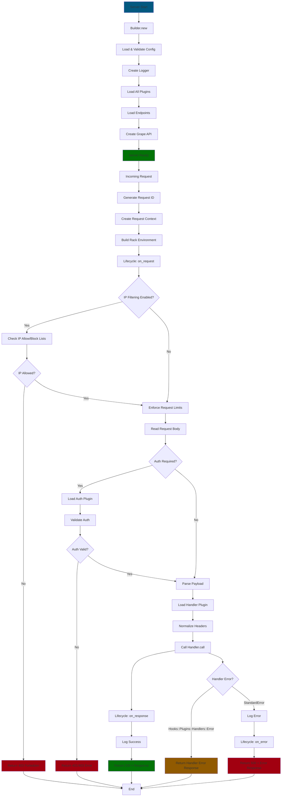

# Architecture Flow

The following Mermaid diagram shows the complete request processing flow, including server bootstrap, plugin loading, and webhook request handling:

```mermaid
flowchart TD
    A[Server Start] --> B[Builder.new]
    B --> C[Load & Validate Config]
    C --> D[Create Logger]
    D --> E[Load All Plugins]
    E --> F[Load Endpoints]
    F --> G[Create Grape API]
    G --> H[Server Ready]
    
    H --> I[Incoming Request]
    I --> J[Generate Request ID]
    J --> K[Create Request Context]
    K --> L[Build Rack Environment]
    L --> M[Lifecycle: on_request]
    
    M --> N{IP Filtering Enabled?}
    N -->|Yes| O[Check IP Allow/Block Lists]
    N -->|No| P[Enforce Request Limits]
    O --> Q{IP Allowed?}
    Q -->|No| R[Return 403 Forbidden]
    Q -->|Yes| P
    
    P --> S[Read Request Body]
    S --> T{Auth Required?}
    T -->|Yes| U[Load Auth Plugin]
    T -->|No| V[Parse Payload]
    
    U --> W[Validate Auth]
    W --> X{Auth Valid?}
    X -->|No| Y[Return 401/403 Error]
    X -->|Yes| V
    
    V --> Z[Load Handler Plugin]
    Z --> AA[Normalize Headers]
    AA --> BB[Call Handler.call]
    BB --> CC[Lifecycle: on_response]
    CC --> DD[Log Success]
    DD --> EE[Return 200 + Response]
    
    BB --> FF{Handler Error?}
    FF -->|Hooks::Plugins::Handlers::Error| GG[Return Handler Error Response]
    FF -->|StandardError| HH[Log Error]
    HH --> II[Lifecycle: on_error]
    II --> JJ[Return 500 + Error Response]
    
    R --> KK[End]
    Y --> KK
    GG --> KK
    EE --> KK
    JJ --> KK
    
    style A fill:#035980
    style H fill:#027306  
    style R fill:#a10010
    style Y fill:#a10010
    style EE fill:#027306
    style JJ fill:#a10010
    style GG fill:#915a01
```
